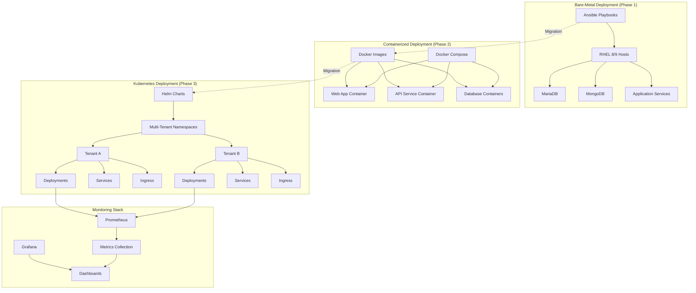
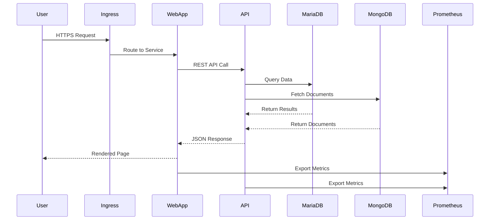

# 🚀 Enterprise Platform - RHEL 8/9 to Kubernetes Migration

[](https://opensource.org/licenses/MIT)
[](https://www.ansible.com/)
[](https://www.docker.com/)
[](https://kubernetes.io/)

A production-ready demonstration of migrating enterprise applications from bare-metal RHEL deployments to containerized Kubernetes infrastructure with multi-tenant support.

## 📋 Table of Contents

- [Overview](#overview)
- [Architecture](#architecture)
- [Features](#features)
- [Technology Stack](#technology-stack)
- [Quick Start](#quick-start)
- [Documentation](#documentation)
- [Project Structure](#project-structure)
- [Contributing](#contributing)
- [License](#license)

## 🎯 Overview

This project demonstrates a complete enterprise platform migration journey:

1. **RHEL 8/9 Compatibility** - Ansible playbooks supporting RHEL, AlmaLinux, and Rocky Linux (versions 8 & 9)
2. **Docker Containerization** - Optimized, production-ready container images
3. **Kubernetes Deployment** - Multi-tenant K8s architecture with RBAC, resource quotas, and autoscaling
4. **Monitoring & Observability** - Integrated Prometheus and Grafana stack
5. **CI/CD Automation** - GitHub Actions pipelines for testing, building, and deployment

## 🏗️ Architecture



### Component Interaction Flow



## ✨ Features

### RHEL 8/9 Ansible Automation
- ✅ Multi-distribution support (RHEL, AlmaLinux, Rocky Linux)
- ✅ Conditional logic for version-specific package management
- ✅ Automated MariaDB and MongoDB installation
- ✅ Service configuration and systemd management
- ✅ OS detection and fact gathering

### Docker Containerization
- ✅ Multi-stage builds for optimized image sizes
- ✅ Security best practices (non-root users, minimal base images)
- ✅ Health checks and graceful shutdown handling
- ✅ Docker Compose orchestration for local development
- ✅ Comprehensive .dockerignore for build optimization

### Kubernetes Deployment
- ✅ Multi-tenant namespace isolation
- ✅ RBAC policies for security
- ✅ Resource quotas and limits
- ✅ Horizontal Pod Autoscaling (HPA)
- ✅ Persistent storage for databases
- ✅ ConfigMaps and Secrets management
- ✅ Ingress controller with path-based routing
- ✅ Helm charts for templated deployments

### Monitoring & Observability
- ✅ Prometheus metrics collection
- ✅ Grafana dashboards
- ✅ ServiceMonitor for Prometheus Operator
- ✅ Application-level metrics export

### CI/CD Pipeline
- ✅ Ansible playbook validation and linting
- ✅ Automated Docker image builds
- ✅ Container vulnerability scanning (Trivy)
- ✅ Kubernetes manifest validation
- ✅ Automated deployment to test clusters
- ✅ Tenant provisioning automation

## 🛠️ Technology Stack

| Category | Technologies |
|----------|-------------|
| **Configuration Management** | Ansible 2.15+ |
| **Containerization** | Docker 24.0+, Docker Compose |
| **Orchestration** | Kubernetes 1.28+, Helm 3.x |
| **Databases** | MariaDB 10.11, MongoDB 7.0 |
| **Monitoring** | Prometheus, Grafana |
| **CI/CD** | GitHub Actions |
| **Languages** | Python 3.11, Node.js 20 |
| **Operating Systems** | RHEL 8/9, AlmaLinux 8/9, Rocky Linux 8/9 |

## 🚀 Quick Start

### Prerequisites

- **For Ansible**: Ansible 2.15+, Python 3.8+
- **For Docker**: Docker 24.0+, Docker Compose 2.x
- **For Kubernetes**: kubectl, Helm 3.x, access to a K8s cluster (minikube, kind, or cloud provider)

### 1. Clone the Repository

```bash
git clone https://github.com/yourusername/enterprise-platform-rhel-k8s.git
cd enterprise-platform-rhel-k8s
```

### 2. Ansible Deployment (Bare-Metal)

```bash
cd ansible

# Update inventory with your hosts
vim inventory/hosts.yml

# Run the main playbook
ansible-playbook -i inventory/hosts.yml playbooks/site.yml

# Or deploy specific components
ansible-playbook -i inventory/hosts.yml playbooks/mariadb.yml
ansible-playbook -i inventory/hosts.yml playbooks/mongodb.yml
```

### 3. Docker Deployment (Local Development)

```bash
cd docker

# Build all images
docker-compose build

# Start all services
docker-compose up -d

# Check status
docker-compose ps

# View logs
docker-compose logs -f

# Stop services
docker-compose down
```

### 4. Kubernetes Deployment

```bash
# Using kubectl
kubectl apply -f kubernetes/namespaces/
kubectl apply -f kubernetes/configmaps/
kubectl apply -f kubernetes/secrets/
kubectl apply -f kubernetes/deployments/
kubectl apply -f kubernetes/services/
kubectl apply -f kubernetes/ingress/

# Or using Helm
cd helm
helm install enterprise-platform ./enterprise-platform \
  --namespace tenant-a \
  --create-namespace \
  --values ./enterprise-platform/values.yaml

# Check deployment status
kubectl get pods -n tenant-a
kubectl get services -n tenant-a
```

### 5. Deploy Monitoring Stack

```bash
kubectl apply -f monitoring/prometheus/
kubectl apply -f monitoring/grafana/

# Access Grafana (port-forward)
kubectl port-forward -n monitoring svc/grafana 3000:3000

# Open http://localhost:3000 (default: admin/admin)
```

## 📚 Documentation

Comprehensive documentation is available in the [`docs/`](./docs) directory:

- **[Architecture Guide](./docs/architecture.md)** - Detailed system architecture and design decisions
- **[Migration Guide](./docs/migration-guide.md)** - Step-by-step migration from bare-metal to Kubernetes
- **[Operations Runbook](./docs/operations-runbook.md)** - Day-2 operations, troubleshooting, backup/recovery
- **[Tenant Provisioning](./docs/tenant-provisioning.md)** - Automated multi-tenant onboarding
- **[Ansible Deployment](./docs/ansible-deployment.md)** - RHEL 8/9 compatibility and usage guide

## 📁 Project Structure

```
enterprise-platform-rhel-k8s/
├── ansible/                    # Ansible playbooks and roles
│   ├── inventory/             # Multi-distro inventory
│   ├── group_vars/            # RHEL 8/9 specific variables
│   ├── playbooks/             # MariaDB, MongoDB, application playbooks
│   └── roles/                 # Reusable Ansible roles
├── docker/                     # Docker configurations
│   ├── web-app/               # Web application Dockerfile
│   ├── api-service/           # API service Dockerfile
│   ├── mariadb/               # Custom MariaDB image
│   ├── mongodb/               # Custom MongoDB image
│   └── docker-compose.yml     # Local orchestration
├── kubernetes/                 # Kubernetes manifests
│   ├── namespaces/            # Multi-tenant namespaces
│   ├── deployments/           # Application deployments
│   ├── services/              # Service definitions
│   ├── configmaps/            # Configuration management
│   ├── secrets/               # Secrets management
│   ├── ingress/               # Ingress controllers
│   ├── rbac/                  # RBAC policies
│   ├── resource-quotas/       # Resource limits
│   ├── hpa/                   # Autoscaling configs
│   └── pvc/                   # Persistent volumes
├── helm/                       # Helm charts
│   └── enterprise-platform/   # Main chart
├── monitoring/                 # Monitoring stack
│   ├── prometheus/            # Prometheus configs
│   └── grafana/               # Grafana dashboards
├── src/                        # Sample application code
│   ├── web-app/               # Python Flask app
│   └── api-service/           # Node.js API
├── .github/                    # CI/CD workflows
│   └── workflows/             # GitHub Actions
├── docs/                       # Documentation
└── README.md                   # This file
```

## 🔄 CI/CD Pipeline

The project includes automated GitHub Actions workflows:

- **`ansible-test.yml`** - Validates Ansible playbooks and runs ansible-lint
- **`docker-build.yml`** - Builds Docker images, scans for vulnerabilities, pushes to registry
- **`k8s-deploy.yml`** - Validates K8s manifests and deploys to test cluster
- **`tenant-provision.yml`** - Automates tenant namespace provisioning

## 🎓 Use Cases

This project demonstrates solutions for:

1. **OS Modernization** - Migrating from RHEL 8 to RHEL 9 family
2. **Infrastructure as Code** - Ansible automation for consistent deployments
3. **Containerization** - Moving from bare-metal to Docker containers
4. **Cloud-Native Architecture** - Kubernetes orchestration with best practices
5. **Multi-Tenancy** - Secure tenant isolation with RBAC and resource quotas
6. **DevOps Automation** - End-to-end CI/CD pipelines
7. **Observability** - Production-ready monitoring and alerting

## 🤝 Contributing

Contributions are welcome! Please feel free to submit a Pull Request.

## 📄 License

This project is licensed under the MIT License - see the [LICENSE](LICENSE) file for details.

## 🙏 Acknowledgments

- Built with best practices from Kubernetes documentation
- Ansible playbooks follow Red Hat recommended patterns
- Docker images optimized using industry standards

---

**⭐ If you find this project helpful, please consider giving it a star!**

For questions or support, please open an issue on GitHub.
