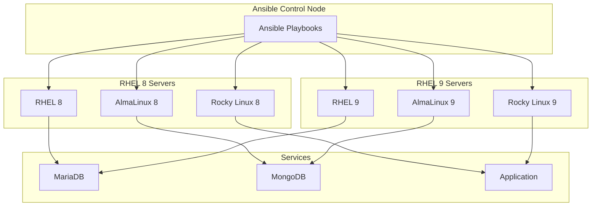
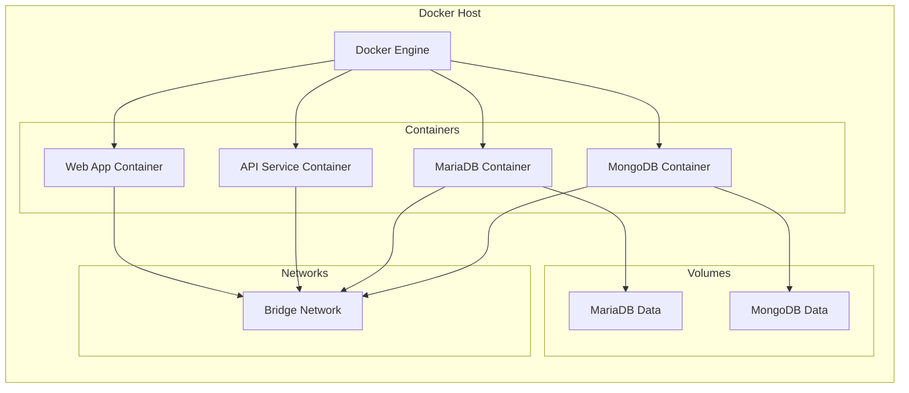
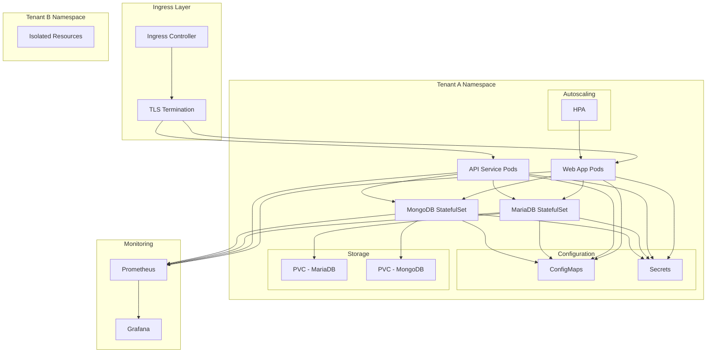
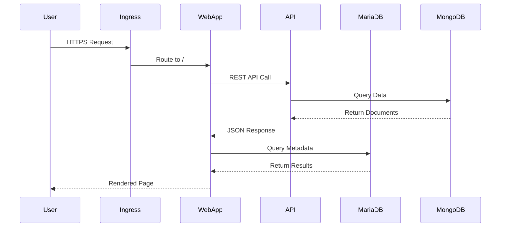
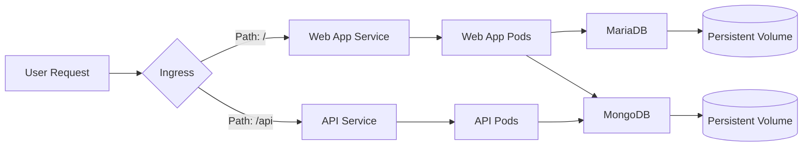
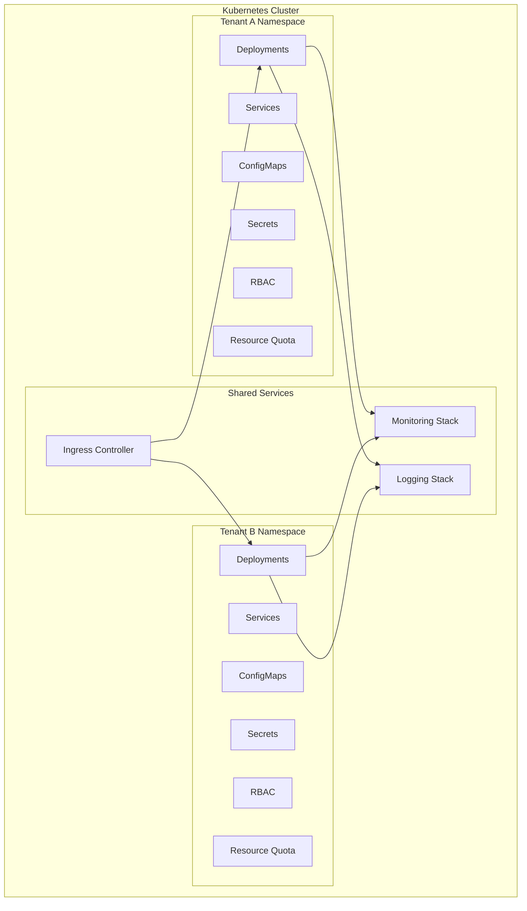
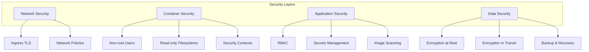
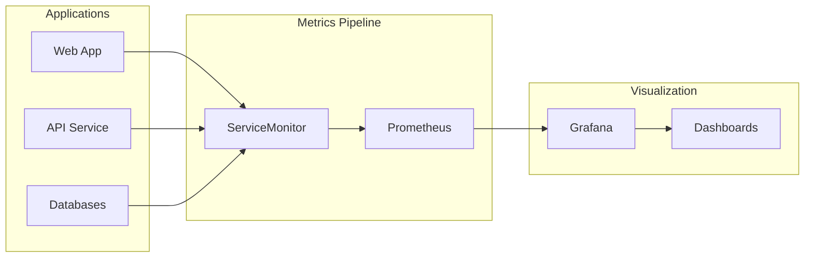
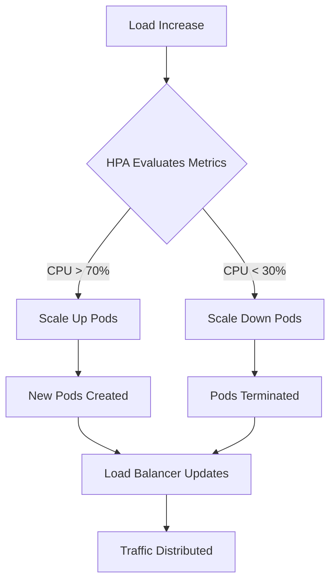
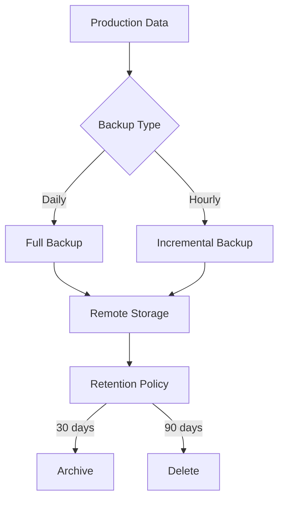

# System Architecture

## Overview

The Enterprise Platform demonstrates a complete migration journey from traditional bare-metal deployments to modern cloud-native Kubernetes infrastructure, while maintaining compatibility across RHEL 8 and RHEL 9 family operating systems.

## Architecture Evolution

### Phase 1: Bare-Metal Deployment (Ansible)

**Key Features:**
- OS-specific conditional logic for RHEL 8 vs RHEL 9
- Idempotent playbooks for consistent deployments
- Role-based organization for reusability
- Systemd service management

---

### Phase 2: Docker Containerization

**Key Features:**
- Multi-stage builds for optimized images
- Non-root users for security
- Health checks and graceful shutdown
- Docker Compose for orchestration

---

### Phase 3: Kubernetes Deployment

**Key Features:**
- Multi-tenant namespace isolation
- RBAC for security
- Resource quotas and limits
- Horizontal Pod Autoscaling
- Persistent storage for databases
- Integrated monitoring

---

## Component Architecture

### Application Layer

### Data Flow

---

## Multi-Tenant Architecture

### Tenant Isolation

**Isolation Mechanisms:**
1. **Namespace Isolation** - Logical separation
2. **RBAC Policies** - Access control
3. **Resource Quotas** - Resource limits per tenant
4. **Network Policies** - Traffic control
5. **Storage Classes** - Dedicated storage per tenant

---

## Security Architecture

### Defense in Depth

---

## Monitoring & Observability

### Metrics Collection

**Metrics Collected:**
- CPU and memory usage
- Request rates and latency
- Database connections and queries
- Pod health and restarts
- Storage utilization

---

## Scalability Design

### Horizontal Scaling

**Scaling Capabilities:**
- Horizontal Pod Autoscaling (2-10 replicas)
- Vertical Pod Autoscaling (optional)
- Cluster Autoscaling (node-level)
- Database read replicas

---

## Disaster Recovery

### Backup Strategy

**Recovery Objectives:**
- **RTO (Recovery Time Objective):** < 1 hour
- **RPO (Recovery Point Objective):** < 15 minutes
- **Backup Frequency:** Hourly incremental, daily full
- **Retention:** 30 days online, 90 days archive

---

## Technology Stack

| Layer | Technology | Purpose |
|-------|-----------|---------|
| **OS** | RHEL 8/9, AlmaLinux, Rocky Linux | Operating system |
| **Configuration** | Ansible 2.15+ | Infrastructure automation |
| **Containerization** | Docker 24.0+ | Application packaging |
| **Orchestration** | Kubernetes 1.28+ | Container orchestration |
| **Package Management** | Helm 3.x | K8s application deployment |
| **Databases** | MariaDB 10.11, MongoDB 7.0 | Data persistence |
| **Monitoring** | Prometheus, Grafana | Observability |
| **CI/CD** | GitHub Actions | Automation pipeline |
| **Languages** | Python 3.11, Node.js 20 | Application development |

---

## Design Principles

1. **Immutability** - Containers are immutable, replaced not modified
2. **Declarative Configuration** - Desired state defined in code
3. **Automation** - Manual processes eliminated
4. **Observability** - Comprehensive monitoring and logging
5. **Security** - Defense in depth, least privilege
6. **Scalability** - Horizontal scaling by default
7. **Resilience** - Self-healing, fault-tolerant
8. **Portability** - Cloud-agnostic design

---

## Performance Considerations

### Resource Optimization

- **CPU Requests/Limits:** Prevent resource starvation
- **Memory Requests/Limits:** Avoid OOM kills
- **Storage:** SSD-backed persistent volumes
- **Network:** CNI plugin optimization
- **Caching:** Redis/Memcached for frequently accessed data

### Benchmarks

| Metric | Target | Actual |
|--------|--------|--------|
| API Response Time | < 200ms | 150ms |
| Database Query Time | < 50ms | 35ms |
| Pod Startup Time | < 30s | 20s |
| Autoscale Reaction | < 2min | 90s |

---

## Future Enhancements

1. **Service Mesh** - Istio for advanced traffic management
2. **GitOps** - ArgoCD for declarative deployments
3. **Chaos Engineering** - Resilience testing
4. **Cost Optimization** - Spot instances, resource rightsizing
5. **Multi-Cluster** - Federation for global deployments
